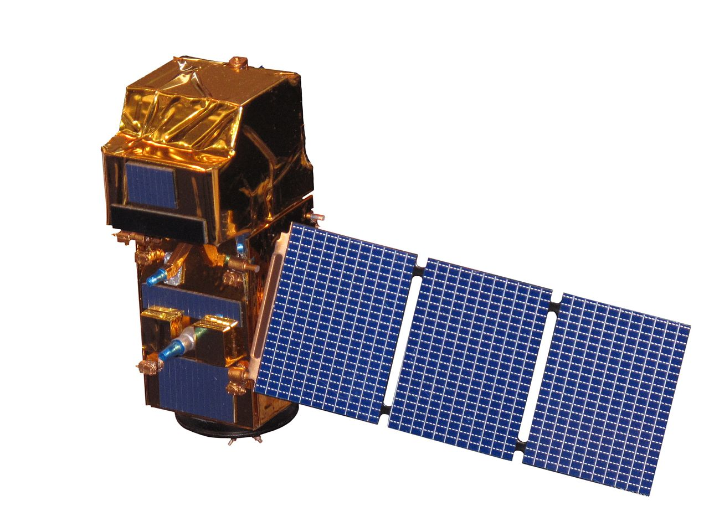

# What is Sentinel-2 ?
- **Sentinel-2** is a **wide-swath, high-resolution, multi-spectral imaging mission** launched by **Copernicus Programme**. 

- Its  optical instrument samples in 13 spectral bands: four bands at 10 metres, six bands at 20 metres and three bands at 60 metres spatial resolution.

```{r echo=FALSE,out.width='45%',fig.align='center'}

```
<center>Source:[Wikipedia-Sentinel-2](https://www.nik.com.tr/content_sistem_uydu.asp?id=102)
---
# What is Sentinel-2 ?
- The Sentinel-2 constellation made of twin satellites. 

- The mission is based on a constellation of **two identical satellites(Sentinel-2A and Sentinel-2B**) in the same orbit, 180° apart for optimal coverage and data delivery.

- Sentinel-2A was launched on 23 June 2015 and Sentinel-2B was launched on 7 March 2017. 

- Each satellite has a swath width of 290 km  to provide systematic coverage over the 
following areas:
(1)all continental land surfaces (including inland waters) between latitudes 84°N and 56°S;
(2)all coastal waters up to at least 20 km from the shore;
(3)all islands greater than 100 km2;
(4)all EU islands;
(5)the Mediterranean Sea;
(6)all closed seas


---
# Purpose
<div class="tabs">
  <button class="tab-button" onclick="showContent('The primary objective', event)">The primary objective</button>
  <button class="tab-button" onclick="showContent('Other important objective', event)">Other important objective</button>
</div>
<div id="The primary objective" class="tab-content">
  <ul>
    <li>Provide high-resolution satellite data</li>
    <li>For land cover, climate change and disaster monitoring [9,10]</li>
  </ul>
</div>

<div id="Other important objective" class="tab-content" style="display:none">
  <ul>
    <li>Complement the other global satellite programmes such as the Landsat and SPOT (Satellite Pour l’Observation de la Terre) satellite programmes </li>
    <li>By ensuring continuity in monitoring the dynamics on Earth’s surface [8,11,12,13]</li>
  </ul>
</div>

<script>
document.addEventListener("DOMContentLoaded", function() {
  // Default open tab
  showContent('The primary objective');
});

function showContent(tabName, event) {
  var i, tabcontent, tabbuttons;
  tabcontent = document.getElementsByClassName("tab-content");
  for (i = 0; i < tabcontent.length; i++) {
    tabcontent[i].style.display = "none";
  }
  tabbuttons = document.getElementsByClassName("tab-button");
  for (i = 0; i < tabbuttons.length; i++) {
    tabbuttons[i].className = tabbuttons[i].className.replace(" active", "");
  }
  document.getElementById(tabName).style.display = "block";
  if (event) {
    event.currentTarget.className += " active";
  } else {
    // Set the first tab as active by default if no event is provided
    document.getElementsByClassName("tab-button")[0].className += " active";
  }
}
</script>

---
# Applications
## Sentinel-2 and Long-term Monitoring
- Since the beginning of the 15th century, the Earth's surface has undergone rapid changes driven by agricultural expansion, climate change, and rapid urbanization. 
- Monitoring tools like Sentinel-2 remotely sensed data are needed to continuously assess the condition of the Earth's surface and inform decision-makers about future changes. 
---
# Applications
## Sentinel-2 and Long-term Monitoring
The potential to strengthen existing policies: especially monitoring long-term (>5 years) land use/cover change. For example: 
- Sentinel-2 data plays a significant role in monitoring the progress towards achieving the **Sustainable Development Goals (SDGs)**【26】. 
- Sentinel data can be accessed **free of charge** at the Copernicus Open Access Hub. Therefore, this data has the potential to contribute to land cover/use monitoring especially in countries where **financial resources for acquiring remotely sensed data are limited**【29】.

---
# Reflections
- The pivotal role of Sentinel-2 data in enhancing land cover/use monitoring on a global scale, signifying a leap forward in the realm of Earth observation.

- The distinction in application and integration of Sentinel-2 data between developed and developing countries highlights a pivotal disparity in resource availability and technological adoption.

- The effectiveness of object-based image analysis (OBIA) and machine learning classifiers, such as Random Forests (RF) and Support Vector Machines (SVM), in improving land cover classification accuracy, heralds a new era in data processing techniques. These methods, capable of harnessing Sentinel-2's high-resolution data, offer profound implications for land management and policy-making.
---
# Reflections
- However, the challenges posed by cloud coverage and the relatively nascent stage of Sentinel-2 imagery's global application cannot be overlooked. 

- The need of expansion of Sentinel-2's application in untested regions compared to the more extensively used Landsat imagery.

- Looking forward, the advent of Sentinel-2 opens new horizons for the private sector, government bodies, the scientific community, and practitioners to increase the availability of high-resolution land cover/use maps at regional, national, continental, and global scales.

---
# References
