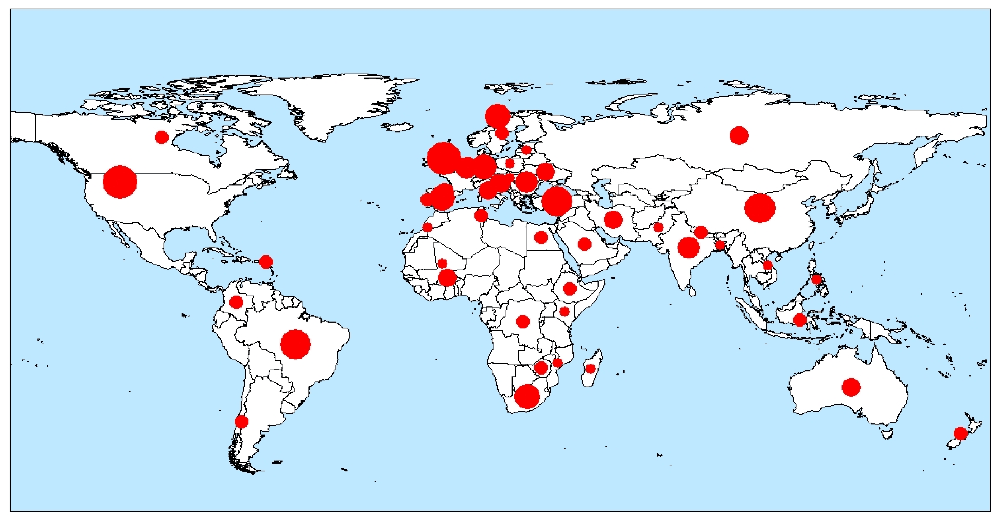

# What is Sentinel-2 ?
- **Sentinel-2** is a **wide-swath, high-resolution, multi-spectral imaging mission** launched by **Copernicus Programme**. 

- Its  optical instrument samples in 13 spectral bands: four bands at 10 metres, six bands at 20 metres and three bands at 60 metres spatial resolution.

```{r echo=FALSE,out.width='45%',fig.align='center'}
knitr::include_graphics('images/Sentinel_2.jpg')
```
<center>Source:Wikipedia-Sentinel-2
---
# What is Sentinel-2 ?
- The Sentinel-2 constellation made of twin satellites. 

- The mission is based on a constellation of **two identical satellites(Sentinel-2A and Sentinel-2B**) in the same orbit, 180° apart for optimal coverage and data delivery.

- Sentinel-2A was launched on 23 June 2015 and Sentinel-2B was launched on 7 March 2017. 

- Each satellite has **a swath width of 290 km** to provide systematic **coverage over the following areas**:
1. all continental land surfaces between latitudes 84°N and 56°S;
1. all coastal waters up to at least 20 km from the shore;
1. all islands greater than 100 km2;
1. all EU islands;
1. the Mediterranean Sea;
1. all closed seas
---
# Sentinel-2 data
- Available in different processed forms(Drusch et al.,2012).

- The main stages include Level-0, Level-1A, Level-1B, Level-1C and Level 2A.
```{r echo=FALSE,out.width='80%',fig.align='center'}

```
<center>Figure: The processing levels and the format of Sentinel-2 data(Phiri et al.,2020)
---
# Purpose
<div class="tabs">
  <button class="tab-button" onclick="showContent('The primary objective', event)">The primary objective</button>
  <button class="tab-button" onclick="showContent('Other important objective', event)">Other important objective</button>
</div>
<div id="The primary objective" class="tab-content">
  <ul>
    <li>Provide high-resolution satellite data</li>
    <li>For land cover, climate change and disaster monitoring(Malenovský et al.,2012)</li>
    <li>
```{r echo=FALSE,out.width='80%',fig.align='center'}

```
    </li>
    <li><center>Figure: Representative distribution of the articles published on Sentinel-2 land cover mapping across the world(Phiri et al.,2020)
    </li>
  </ul>
</div>

<div id="Other important objective" class="tab-content" style="display:none">
  <ul>
    <li>Complement the other global satellite programmes such as the Landsat and SPOT (Satellite Pour l’Observation de la Terre) satellite programmes </li>
    <li>By ensuring continuity in monitoring the dynamics on Earth’s surface</li>
    <li>
```{r echo=FALSE,out.width='50%',fig.align='center'}

```
    </li>
    <li><center>Figure: Figure: Sentinel-2 scene of the cropland test site Marchfeld in Lower Austria, Austria. The dots represent the centroids of the reference polygons used for classification. The top-right map shows the inter- and intra-field heterogeneity observed at the S2 spatial resolution of 10 m(Immitzer, Vuolo & Atzberger,2016)
    </li>
  </ul>
</div>

<script>
document.addEventListener("DOMContentLoaded", function() {
  // Default open tab
  showContent('The primary objective');
});

function showContent(tabName, event) {
  var i, tabcontent, tabbuttons;
  tabcontent = document.getElementsByClassName("tab-content");
  for (i = 0; i < tabcontent.length; i++) {
    tabcontent[i].style.display = "none";
  }
  tabbuttons = document.getElementsByClassName("tab-button");
  for (i = 0; i < tabbuttons.length; i++) {
    tabbuttons[i].className = tabbuttons[i].className.replace(" active", "");
  }
  document.getElementById(tabName).style.display = "block";
  if (event) {
    event.currentTarget.className += " active";
  } else {
    // Set the first tab as active by default if no event is provided
    document.getElementsByClassName("tab-button")[0].className += " active";
  }
}
</script>
---
# Applications
### Pixel-Based Image Analysis 
- One of the most **common classification approaches** applied to Sentinel-2.

- **RF** is the most common classifiers used for pixel-based approach.

- Due to the **limitations of pixel-based approaches, such as salt-and-pepper effect or speckle—spectral noise**, **sub-pixel methods** have been applied on Sentinel-2 data to improve the classification accuracy(Clark,2017). 

- **To reduce mixed pixel effects**,Spectral mixture analysis (SMA) is one of the robust methods. For example, Degerickx, et al. applied Multiple Endmember Spectral Mixture Analysis (MESMA) to urban land cover/use and achieved an accuracy of 85%.

---
# Applications
### Object-Based Image Analysis
- OBIA produces higher classification accuracy compared to pixel-based(Gašparović & Jogun,2018).
- Many studies have focused on the application of **the combination of OBIA with machine-learning classifiers** on land cover/use classification (Novelli et al.,2016).

```{r echo=FALSE,out.width='60%',fig.align='center'}

```
<center>Figure: Location of the study area depicted by means of the Red band of the Sentinel-2 image(Novelli et al.,2016)

---
# Reflections
.pull-left[
### Opportunities
- The revelation between OBIA and advanced ML classifiers marks a transformative shift in data processing techniques. 

- Promise incremental improvements in **land cover and use classification**.

- Herald a paradigm shift in how we approach **environmental monitoring and land management**.
]
.pull-right[
### Challenges
- **Cloud coverage** obscures the full potential of optical satellite imagery. 

- The need of **expansion of is application in untested regions**.

- Its adoption is **in its early stages**, especially when juxtaposed with the legacy of the Landsat program.
]

---
# Reflections
Looking ahead, the emergence of Sentinel-2 data opens up new vistas for a diverse array of stakeholders, including the private sector, government agencies, academia, and environmental practitioners.

- This expansion is not just about scaling the heights of technological innovation; it's about **democratizing access to high-quality, timely, and actionable environmental data**. 

- The imperative to integrate Sentinel-2 data into **regional, national, and global environmental** strategies is clear. 

- The journey ahead is fraught with challenges, yet it's imbued with the promise of harnessing our planet's spectral signatures to **foster a more sustainable and resilient world**.

---
# References
Clark, M. L. (2017). Comparison of simulated hyperspectral HyspIRI and multispectral Landsat 8 and Sentinel-2 imagery for multi-seasonal, regional land-cover mapping. Remote Sensing of Environment, 200, 311-325.

Degerickx, J., Roberts, D. A., & Somers, B. (2019). Enhancing the performance of Multiple Endmember Spectral Mixture Analysis (MESMA) for urban land cover mapping using airborne lidar data and band selection. Remote sensing of environment, 221, 260-273.

Drusch, M., Del Bello, U., Carlier, S., Colin, O., Fernandez, V., Gascon, F., ... & Bargellini, P. (2012). Sentinel-2: ESA's optical high-resolution mission for GMES operational services. Remote sensing of Environment, 120, 25-36.

Gašparović, M., & Jogun, T. (2018). The effect of fusing Sentinel-2 bands on land-cover classification. International journal of remote sensing, 39(3), 822-841.

Immitzer, M., Vuolo, F., & Atzberger, C. (2016). First experience with Sentinel-2 data for crop and tree species classifications in central Europe. Remote sensing, 8(3), 166.

---
# References
Malenovský, Z., Rott, H., Cihlar, J., Schaepman, M. E., García-Santos, G., Fernandes, R., & Berger, M. (2012). Sentinels for science: Potential of Sentinel-1,-2, and-3 missions for scientific observations of ocean, cryosphere, and land. Remote Sensing of environment, 120, 91-101.

Novelli, A., Aguilar, M. A., Nemmaoui, A., Aguilar, F. J., & Tarantino, E. (2016). Performance evaluation of object based greenhouse detection from Sentinel-2 MSI and Landsat 8 OLI data: A case study from Almería (Spain). International journal of applied earth observation and geoinformation, 52, 403-411.

Sentinel, E. S. A. (2014). Missions-Sentinel Online. ESA: Paris, France.

Phiri, D., Simwanda, M., Salekin, S., Nyirenda, V. R., Murayama, Y., & Ranagalage, M. (2020). Sentinel-2 data for land cover/use mapping: A review. Remote Sensing, 12(14), 2291.